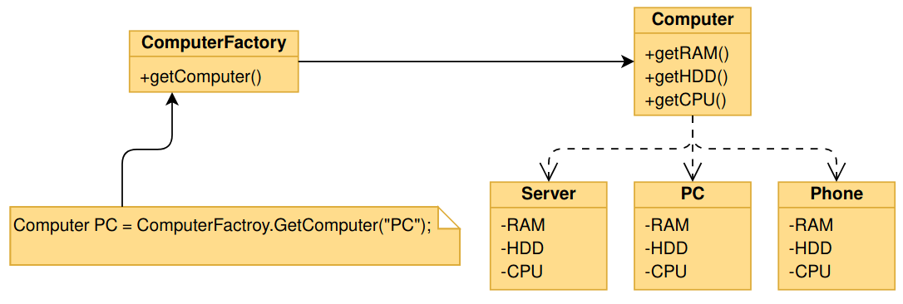

### Factory Pattern
**Type : creational design pattern**

A Factory Pattern or Factory Method Pattern says that 
**just define an interface or abstract class for creating 
an object but let the subclasses decide which class to 
instantiate**. In other words, subclasses are responsible 
to create the instance of the class.

The code that uses the factory method (often called the client code) 
doesn’t see a difference between the actual products returned by 
various subclasses. The client treats all the products as abstract 
Computer. The client knows that all computers objects are supposed 
to have the common method, but exactly how it works isn’t important 
to the client.

####Usage?
  * When a class doesn't know what sub-classes will be required to create
  * When a class wants that its sub-classes specify the objects to be created.
  * When the parent classes choose the creation of objects to its sub-classes.

####Pros and cons
Pros:
   +  You avoid tight coupling between the creator and the concrete products.
   +  Single Responsibility Principle. You can move the product creation code 
        into one place in the program, making the code easier to support.
   +  Open/Closed Principle. You can introduce new types of products into 
        the program without breaking existing client code.

Cons:

  - The code may become more complicated since you need to introduce a lot 
    of new subclasses to implement the pattern. The best case scenario is 
    when you’re introducing the pattern into an existing hierarchy of creator classes. 

####UML
